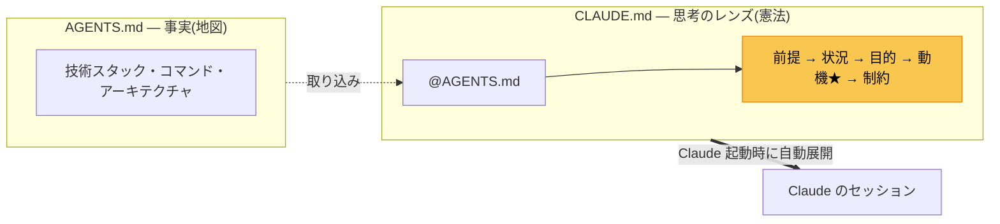
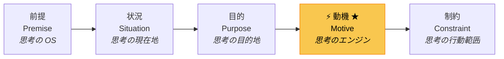

<div align="center">

# cognitive-init

### **事実と思考のレンズを分離する Claude Code スキル**

<p align="center">
  
  
  
</p>

<p align="center">
  <a href="#クイックスタート">クイックスタート</a> •
  <a href="#なにが違うのか">なにが違うのか</a> •
  <a href="#5-要素の思考のレンズ">思考のレンズ</a> •
  <a href="#出力例">出力例</a> •
  <a href="#参考資料">参考資料</a>
</p>

</div>

---

<div align="center">

## **生成されるもの**



`claude /init` が 1 ファイルに詰め込むものを **事実** と **判断軸** に分離し、
Claude 起動時にプロジェクト固有の憲法が装着される構造を作る。

</div>

---

## クイックスタート

```bash
# クローン
git clone https://github.com/sfio/cognitive-init.git

# プロジェクトに配置
mkdir -p <your-project>/.claude/skills/
cp -r cognitive-init/.claude/skills/cognitive-init <your-project>/.claude/skills/

# または個人のグローバル設定に配置
cp -r cognitive-init/.claude/skills/cognitive-init ~/.claude/skills/
```

Claude Code で `init して` と話しかけるだけでトリガーされる。

---

## なにが違うのか

| 通常の `/init`                             | cognitive-init                                                        |
| ------------------------------------------ | --------------------------------------------------------------------- |
| 事実と判断軸が 1 ファイルに混在            | **AGENTS.md**(事実)と **CLAUDE.md**(レンズ)に分離                     |
| 「あなたはプロの〇〇です」式のロールプレイ | **コグニティブ・デザイン** で内面的なレンズを装着                     |
| 動機が書かれない or 汎用的                 | **インタビューで深掘り** — 浅い答えで止まらず具体の過去事例まで降ろす |
| 生成して終わり                             | **承認ゲート** による段階的進行。黙って上書きしない                   |

---

## 5 要素の思考のレンズ

CLAUDE.md は以下の固定順序で構成される。**動機(Motive)が核心**:



> 動機は「意図されたバイアス」の宣言であり、ユーザー自身の言葉でなければ機能しない。Claude が勝手に動機を決めることは禁則。

---

## 出力例

ファイルバックアップ CLI（Go）に対して実行した場合の、実際の CLAUDE.md 動機セクション:

```markdown
## 動機 (Motive) — 思考のエンジン ★ 核心

- 速くしたいのでも、多機能にしたいのでもない。
- 「間違っても大事な写真や書類を失わない」という安心感を得ること。
- rsync の --delete でヒヤッとした経験の裏返しとして、
  削除の概念そのものをコードから消したい。
- 半年後にうっかり src を壊したとき、
  「dst から戻せる」と迷わず言える自分でいたい。
```

通常の `/init` はこの種の内容を生成しない。「Go 1.22 で cobra を使っています」で終わる。cognitive-init はインタビューを通じて **なぜこのコードを書いているのか** を引き出し、Claude の判断軸に据える。

---

## 既存ファイルの取り扱い

| ケース | 状況                      | 動作                                            |
| ------ | ------------------------- | ----------------------------------------------- |
| **A**  | 何もない                  | 新規作成                                        |
| **B**  | 旧形式の CLAUDE.md がある | 事実を AGENTS.md に切り出す移行案を diff で提示 |
| **C**  | AGENTS.md だけある        | 削除テストで圧縮 → CLAUDE.md を新規作成         |
| **D**  | 両方ある                  | レンズ形式か確認し、追加・修正を diff で提示    |

---

## ファイル構成

```
cognitive-init/
├── README.md
├── LICENSE
└── .claude/skills/cognitive-init/
    └── SKILL.md          # スキル本体(シングルファイル)
```

---

## 参考資料

| 出典                                                                                                                         | このスキルへの影響                                                                                  |
| ---------------------------------------------------------------------------------------------------------------------------- | --------------------------------------------------------------------------------------------------- |
| [makotosaekit — 「メタプロンプト」から「コグニティブデザイン」へ](https://qiita.com/makotosaekit/items/0eccb562bf7d3f66fbfa) | CLAUDE.md の設計思想。ロールプレイではなく 5 要素の思考のレンズで Claude の内面を構成するアプローチ |
| [farstep — 効果的な CLAUDE.md の書き方](https://zenn.dev/farstep/articles/how-to-write-a-great-claude-md)                    | AGENTS.md の設計思想。200 行以内・削除テスト・Progressive Disclosure による高シグナル事実集の書き方 |

---

<div align="center">

**MIT License** — 詳細は [LICENSE](./LICENSE)

<sub>思考の核を、他者に明け渡さない</sub>

</div>
